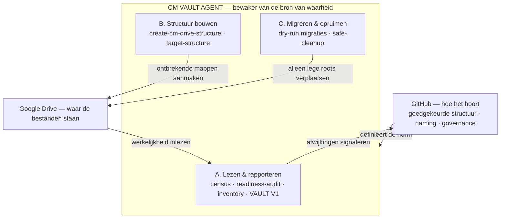

# CM VAULT — Architectuur & Rol

> Versie: v1.0 · Status: **KNOWLEDGE BASE — beschrijvend (geen statuswijziging)** · Datum: 2026-08-07
> Eigenaar: CM VAULT AGENT · Beheer: CM VAULT AGENT · Governance: CM CONTROL AGENT
> Scope: wat VAULT is, uit welke bouwstenen het bestaat, en wat het nooit doet.
> Bronnen: `ACTIVE/CM_VAULT_AGENT.md`, `SYSTEMS/CM_VAULT_V1.md`, `scripts/google-drive/`.

---

## 1. Kernrol — de bewaker van de bron van waarheid

VAULT is de **bibliothecaris/bewaker** van hoe de opslag is georganiseerd. De hele
bestaansreden is het sluitend houden van de brug tussen twee werelden:

> **GitHub bepaalt hóe het hoort** (goedgekeurde structuur, naming, governance).
> **Google Drive is waar de bestanden écht staan.**
> **VAULT zorgt dat die twee blijven kloppen.**

Dat gebeurt in drie stappen, in deze volgorde:

1. **Waarheid vaststellen** — inventariseren en auditen wat er echt in de Drive staat.
2. **Afwijkingen signaleren** — ontbrekende mappen, duplicaten, verkeerd geplaatste of
   verkeerd benoemde bestanden; rapporteren naar `info@custommade.agency`, Template Register
   en AS_BUILT.
3. **De skeletstructuur klaarzetten** — de goedgekeurde mappenstructuur idempotent en
   non-destructief (her)opbouwen.

Rolafbakening binnen CM_OS: **OPS voert uit · CONTROL bewaakt beslissingen · VAULT bewaakt
dat de opslag ordelijk en betrouwbaar blijft** — de stille archivaris die nooit iets weggooit.

---

## 2. Bouwstenen

VAULT bestaat uit **één Make-scenario** en een set **Apps Scripts**. Rode draad: lezen eerst,
minimaal schrijven, nooit verwijderen, risico altijd achter een dry-run, alles handmatig
gestart (op het wekelijkse VAULT V1-schema na).

### A. Lezen & rapporteren (audit / signaleren)

| Bouwsteen | Wat het doet | Schrijft? |
|---|---|---|
| Make **CM VAULT V1** *(nu PAUSED)* | Wekelijkse read-only check van 9 verplichte submappen per artiest → `AANWEZIG/ONTBREKEND`-mailrapport | Nee (alleen mail) |
| `cm-drive-census.gs` | Telt per map submappen, bestanden, grootte, laatste wijziging; echte data vs. leeg | Nee |
| `cm-drive-readiness-audit.gs` | Audit van `OS_CUSTOMMADE` tegen de CM OS Baseline → Markdown-rapport | Nee |
| `export-drive-inventory.gs` | Eén regel per map naar een Google Sheet (migratie-review) | Alleen output-Sheet |
| `export-04-business-inventory.gs` | Read-only inventory van `04_BUSINESS` naar een Sheet | Alleen output-Sheet |

### B. Structuur bouwen (idempotent, nooit verwijderen)

| Bouwsteen | Wat het doet | Veiligheid |
|---|---|---|
| `create-cm-drive-structure.gs` | Maakt de goedgekeurde structuur aan (roots, 9 submappen per artiest, client-/deal-helpers) | Alleen ontbrekende mappen; nooit verwijderen/hernoemen/verplaatsen; herbruikt bestaande |
| `OS_CUSTOMMADE_target_structure.gs` | "Safe-root repair": zet de 11 AS-BUILT roots klaar | Alleen ontbrekende mappen; bij fout → NO-GO |

### C. Migreren & opruimen (verplaatsen — achter dry-run, nooit verwijderen)

| Bouwsteen | Wat het doet | Veiligheid |
|---|---|---|
| `migrate-os-custommade-roots.gs` | Simuleert de root-migratie → log in Sheets | `DRY_RUN` hard true; verplaatst/verwijdert niets |
| `live-migrate-os-custommade-safe-roots.gs` | Verplaatst alléén expliciet goedgekeurde roots | Dry-run default; live alleen bij 2 operator-vlaggen; geen deletes/rechten |
| `SAFE_ROOTS_MIGRATION_CONFIG_2G.gs` | Config (bron per folder-ID) voor het migratiescript | Dry-run only |
| `safe-cleanup-wrong-roots.gs` | Verplaatst alleen **volledig lege** verkeerde roots naar archief | Content-mappen → `REVIEW_REQUIRED`, onaangeroerd; verwijdert nooit |

---

## 3. Schema

---

## 4. Wat VAULT nooit doet (ingebakken guardrails)

In élke bouwsteen bewust afgedekt:

- **Niet verwijderen** — geen enkele bouwsteen heeft een delete/trash op Drive-content.
- **Niet hernoemen** en **geen inhoud wijzigen**.
- **Geen risicovolle verplaatsing zonder dry-run + menselijke bevestiging**.
- Geen publicatie, geen klantcommunicatie, geen deals, geen governancewijziging.

Hierdoor is VAULT de **laagste-risico agent** en het logische **proefmodel** voor certificering.

---

## 5. Huidige operationele status

- **Als autonome agent:** nog niet operationeel — **Level 1 (Governance Approved)**.
- **Make CM VAULT V1:** `PAUSED` (governance-besluit 2026-08-07: gates eerst).
- **Apps Scripts:** bestaan als handmatige gereedschappen; niet automatisch gepland.

Certificeringstraject en gates: `docs/05_OPERATIONS/AGENTS/CERTIFICATION/AGENT_PASSPORT_CM_VAULT.md`.
Scenario-detail: `docs/05_OPERATIONS/KNOWLEDGE_BASE/SYSTEMS/CM_VAULT_V1.md`.
